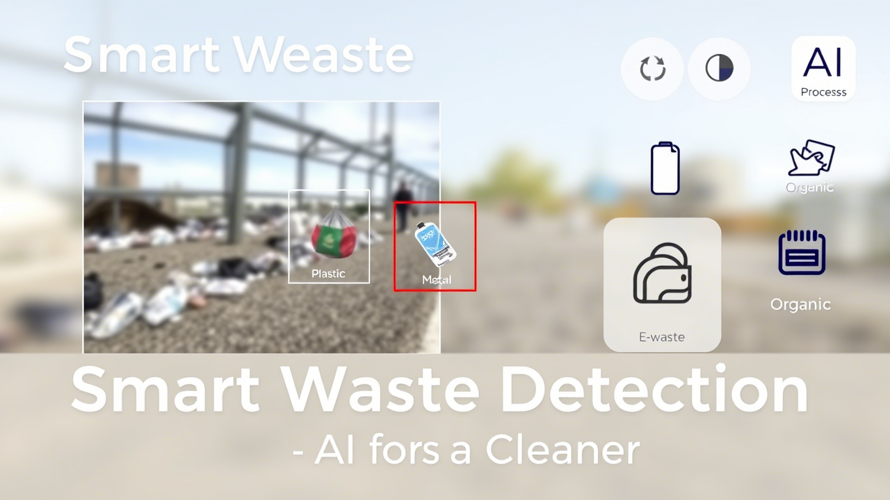

  

<h3 align="center">Waste Detection Using YOLO v5</h3>

## ⛏️ Built Using 

- [MongoDB](https://www.mongodb.com/) - Database
- [Express](https://expressjs.com/) - Server Framework
- [VueJs](https://vuejs.org/) - Web Framework
- [NodeJs](https://nodejs.org/en/) - Server Environment

## 🎉 Acknowledgements 

- Hat tip to anyone whose code was used
- Inspiration
- References
